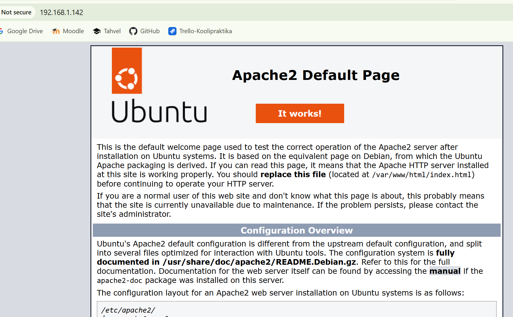
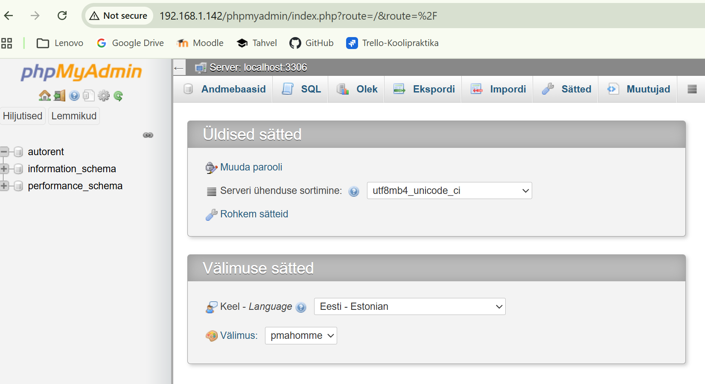
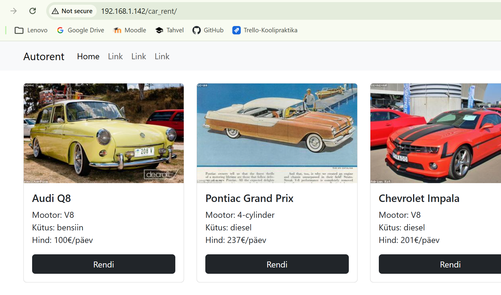
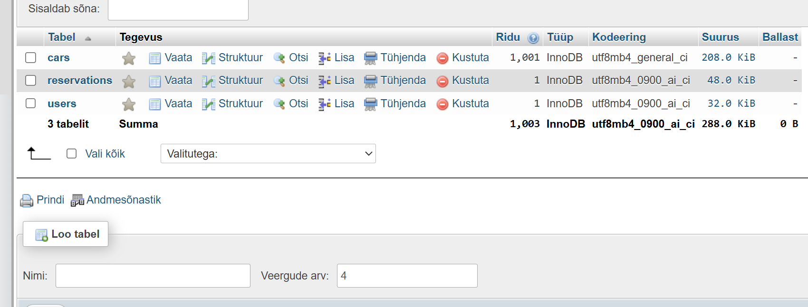
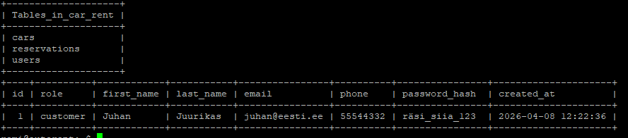

# Autorendi Projekt - Remi Treier

See on õppeülesande raames valminud autorendi veebirakendus, 
mis on paigaldatud Ubuntu 22.04 LTS virtuaalmasinasse(IP:192.168.1.142).

## Projekti osad
* **Veebiserver:** Apache2
* **Andmebaas:** MySQL (Andmebaas: `car_rent`, 3 tabelit: `cars`, `users`, `reservations`)
* **Keel:** PHP
* **Andmebaasi kasutaja:** Remi
* **Haldusliides:** phpMyAdmin
* **Tabelid:** `cars`, `users`, `reservations`

## Paigaldamine

1. **Andmebaasi seadistamine:**
   - Loo andmebaas `car_rent`.
   - Impordi struktuur failist `db/car_rent_final.sql`:
     ```bash
     mysql -u Remi -p car_rent < db/car_rent_final.sql
     ```

2. **Konfiguratsioon:**
   - Kontrolli andmebaasi ühendust failis `config.php`.
   - Kasutaja: `Remi`, Parool: `remi`.

3. **Kasutamine:**
   - Veebileht on kättesaadav aadressil: `http://192.168.1.142/car_rent`

## Tehtud muudatused
- Lisatud `users` tabel kliendiandmete jaoks.
- Lisatud `reservations` tabel broneeringute haldamiseks (seotud `cars` ja `users` tabelitega).
- Lisatud testandmed andmebaasi testimiseks.

## Tõendusmaterjal

### Apache toorik


### phpMyAdmin algul


### Veebirakenduse vaade


### Andmebaasi struktuur


### Andmed konsoolis


